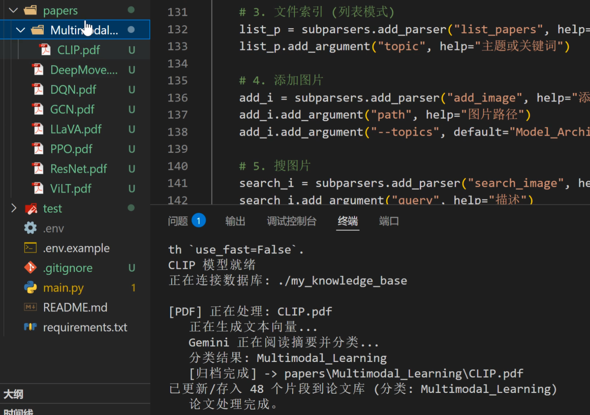
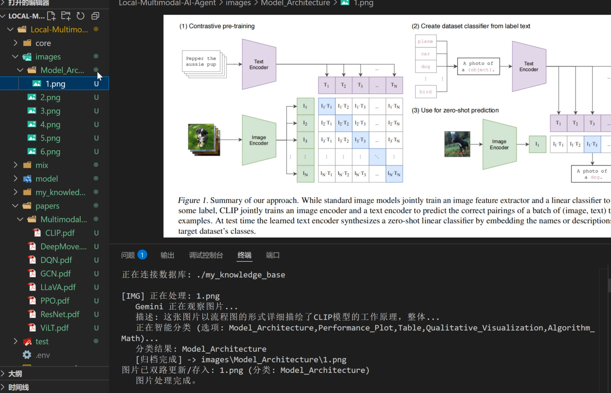
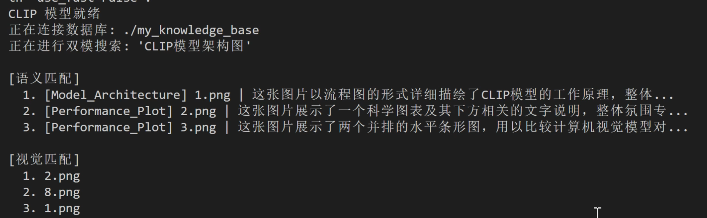
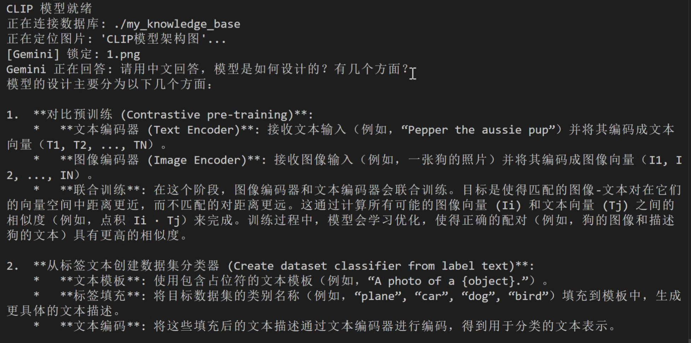
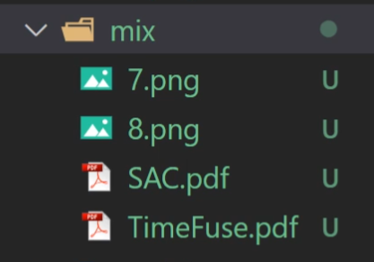
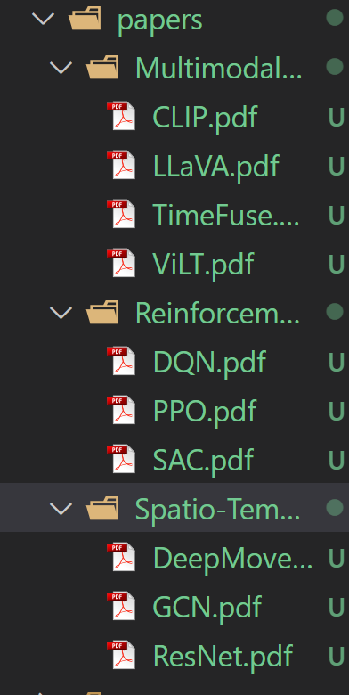

# Local Multimodal AI Agent

> 项目：基于 Gemini 与 CLIP 的本地知识库助手，支持论文语义检索、图片自动分类整理及以文搜图。

## 1. 项目简介

本项目是一个基于 Python 的本地化多模态知识库助手，旨在解决工程与科研场景下**大量文献与图像素材**管理困难的问题。

不同于传统的文件名关键词搜索，本项目利用 **多模态神经网络** 与 **大语言模型** 技术，实现了对本地内容的**深度语义理解**。系统不仅支持“以文搜文”、“以文搜图”，还具备自动根据语义对论文和图片进行**智能分类归档**、以及针对内容进行问答等高级功能。

本项目采用 **Gemini Pro** 作为核心语义理解引擎，配合 **CLIP** 模型进行视觉特征对齐，并使用 **ChromaDB** 作为本地向量数据库，构建了一个轻量级但高性能的 RAG 系统。

## 2. 核心功能

### 2.1 智能文献管理

- **深度语义搜索**
	基于 RAG 技术，将用户的自然语言提问转化为高维向量，在本地切片数据库中检索最相关的论文片段。系统会将检索到的上下文提交给 Gemini 模型，由其**生成基于事实的精准总结回答**。
	
- **自动化归档与整理**
    - **单文件处理**：对论文切片入库，自动提取 PDF 摘要，由 LLM 分析其所属领域（如 CV, NLP, RL），并将其物理移动到对应的分类文件夹。
    - **批量整理**：支持扫描混乱文件夹，自动识别 PDF 并完成分类入库。
        
- **文件索引**
	根据输入查询的语义向量，计算与库中论文的相似度，按匹配得分进行初排，再利用Gemini进行二次排序，准确筛选核心参考文献。这一操作极大地提升了准确性。

### 2.2 智能图像管理

- **智能图片分类与归档**
	系统在读取图片时，会利用多模态模型理解图片内容，并将其自动移动到对应的分类文件夹中，告别杂乱的截图文件夹。
	由于考虑的场景是论文归纳整理，所以图片的默认分类也是按照论文类型设计的：`Model_Architecture,Performance_Plot,Table,Qualitative_Visualization,Algorithm_Math`
    
- **双路混合搜图**
    采用“视觉+语义”的双重匹配架构以提高搜索准确率。
    1. **视觉匹配**：利用 CLIP 模型提取图像的视觉特征。
    2. **语义匹配**：利用 Gemini 模型生成详细的图片描述并向量化。
	这样既可以通过视觉相似度搜索，也可以通过复杂的自然语言描述精准查找图片。由于增加了Gemini，可以处理比较复杂的图片，比如论文截图。
	
- **图片问答**
    在定位到具体图片后，用户可针对该图片内容进行提问，系统将调用多模态大模型进行解析并回答。

## 3. 技术选型

本项目采用了模块化设计，核心组件如下：

| **组件**              | **技术/模型**             | **说明**                  |
| ------------------- | --------------------- | ----------------------- |
| **LLM**             | **Google Gemini Pro** | 负责文本总结、论文/图片分类、描述生成及问答。 |
| **Embeddings (文本)** | **Gemini Embedding**  | 用于将论文切片、用户问题转化为高维向量。    |
| **Embeddings (视觉)** | **OpenAI CLIP**       | 用于提取图像的视觉特征向量，实现以文搜图。   |
| **Vector DB**       | **ChromaDB**          | 轻量级嵌入式向量数据库，无需服务器配置。    |
| **File Handler**    | **PyPDF2**            | 用于 PDF 文件的读取与切片处理。      |

## 4. 环境配置

### 前置要求

- Python 3.8+
- Google API Key (用于调用 Gemini)

### 安装步骤

1. **克隆仓库**
	``` bash
	git clone https://github.com/Bella2013quq/Local-Multimodal-AI-Agent.git
	cd Local-Multimodal-AI-Agent
    ```
    
2. **安装依赖**
    ```bash
    pip install -r requirements.txt
    ```
    
3. 配置 API Key
    
    在项目根目录找到 core/config.py，或创建 .env 文件：
    ``` Python
    # core/config.py
    GOOGLE_API_KEY = "your_api_key_here"
    ```
    

## 5. 使用说明

本项目通过 `main.py` 提供统一的命令行入口。

### 5.1 文献管理功能

1. 添加单篇论文

系统自动判断论文领域并移动文件。

```Bash
python main.py add_paper papers/CLIP.pdf --topics "Reinforcement_Learning,Spatio-Temporal_Mining,Multimodal_Learning"
```

2. 语义搜索论文

向你的本地知识库提问。

```Bash
python main.py search_paper "CLIP主要做了什么？"
```

3. 列出相关论文

查找与某个主题最相关的论文列表。

```Bash
python main.py list_papers "关于图片分类的论文"
```

### 5.2 图像管理功能

1. 添加图片并且自动分类

系统会自动生成描述、计算向量，并将图片移动到指定分类文件夹。

- 默认分类包括：Model_Architecture, Performance_Plot, Table, Qualitative_Visualization 等。
    
``` Bash
# 使用默认分类
python main.py add_image images/result_plot.png

# 自定义分类主题
python main.py add_image images/cat.jpg --topics "Animal,Landscape,Portrait"
```

2. 以文搜图

通过自然语言描述查找图片。

```Bash
python main.py search_image "CLIP模型架构图"
```

3. 搜图并提问

先找到图片，然后针对图片内容提问。

```Bash
python main.py ask_image "CLIP模型架构图" "模型是如何设计的？有几个方面？"
```

### 5.3 批量整理

**一键扫描**指定文件夹下的所有 PDF 和图片，自动进行入库、向量化，并**根据内容自动分类移动**到相应子文件夹。

```Bash
# 同时定义论文分类和图片分类
python main.py batch_ingest ./mix --topics "Reinforcement_Learning,Spatio-Temporal_Mining,Multimodal_Learning" --img_topics "Model_Architecture,Performance_Plot,Table,Qualitative_Visualization,Algorithm_Math"
```

## 6. 项目结构

```Plaintext
Local-Multimodal-AI-Agent/
│
├── main.py                  # 项目主入口，包含命令行参数解析与逻辑分发
├── requirements.txt         # 项目依赖列表
├── README.md                # 项目说明文档
├── .env.example             # api隐藏文件配置示例
│
├── core/                    # 核心逻辑模块
│   ├── __init__.py
│   ├── config.py            # 配置信息
│   ├── ai_handler.py        # 封装 Gemini 和 CLIP 的调用接口
│   ├── db_handler.py        # 封装 ChromaDB 的增删改查操作
│   └── file_handler.py      # 文件读取、切片与智能移动操作
│
├── papers/                  # 论文库（程序会自动在此创建分类子文件夹）
├── images/                  # 图片库（程序会自动在此创建分类子文件夹）
│
└── report                   # 报告资料库，储存readme的图片和视频
```

## 7. 演示与截图
### 7.1 文献管理功能展示

1. 添加单篇论文



2. 语义搜索论文

|           CLIP搜索结果展示            |          Gemini优化后搜索结果展示          |
| :-----------------------------: | :-------------------------------: |
|  |  |
	在只使用CLIP查询时，出现了语义漂移，提问为图片分类，SAC（强化学习任务）排到了 CLIP（多模态图像分类）前面。这可能是由于通用术语对CLIP产生了干扰。
	在使用Gemini进行二次排序后，由于其丰富的上下文联系能力，判断准确了许多。
	
3. 列出相关论文


### 7.2 图像管理功能展示

1. 添加图片并且自动分类




2. 以文搜图


	分别用Gemini和CLIP进行了两次排序，分别安装LLM的理解和图像信息的检索来排序。CLIP模型误把一张结果图判断为架构，引入LLM升级后判断更准确一些，正确识别出了CLIP论文的模型架构图。

3. 搜图并提问


### 7.3 批量整理功能展示

**一键扫描**指定文件夹下的所有 PDF 和图片，自动进行入库、向量化，并**根据内容自动分类移动**到相应子文件夹。

分类前文件夹：


论文分类效果展示：


图片分类效果展示：

| **Algorithm_Math**            |                  |
| ----------------------------- | ------------------------------------------ |
| **Model_Architecture**        | ****        |
| **Performance_Plot**          | ****          |
| **Qualitative_Visualization** | **** |
| **Table**                     | ****                     |

### 7.3 演示视频

<video src="https://github.com/user-attachments/assets/88d5b057-5e50-443d-95b9-6d58017826a2" controls="controls" muted="muted" style="max-width: 100%"></video>

